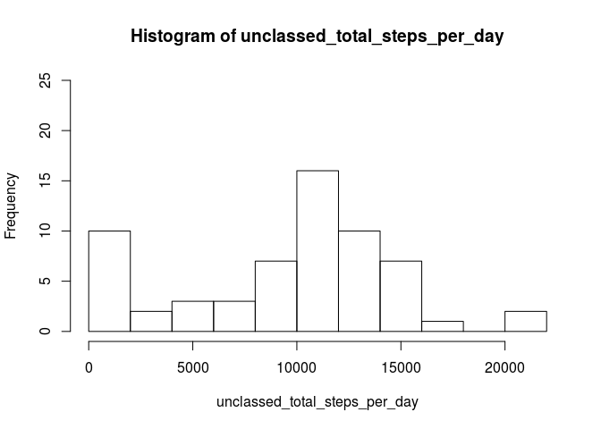
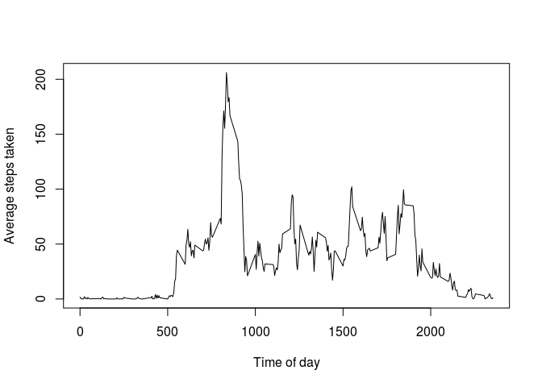
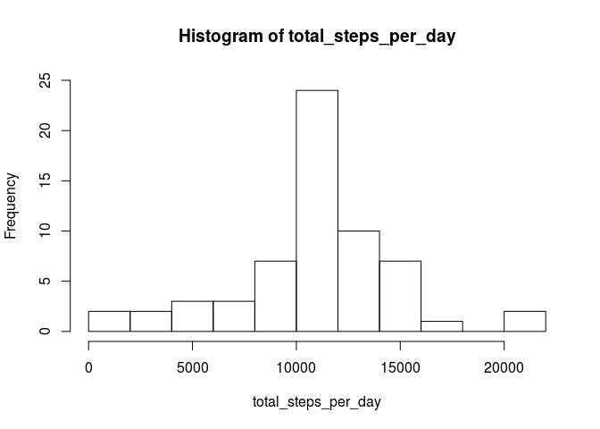

# Reproducible Research: Peer Assessment 1


## Loading and preprocessing the data


```r
data = read.csv('activity.csv', colClasses=c('numeric', 'Date', 'numeric'))
head(data)
```

```
##   steps       date interval
## 1    NA 2012-10-01        0
## 2    NA 2012-10-01        5
## 3    NA 2012-10-01       10
## 4    NA 2012-10-01       15
## 5    NA 2012-10-01       20
## 6    NA 2012-10-01       25
```

```r
tail(data)
```

```
##       steps       date interval
## 17563    NA 2012-11-30     2330
## 17564    NA 2012-11-30     2335
## 17565    NA 2012-11-30     2340
## 17566    NA 2012-11-30     2345
## 17567    NA 2012-11-30     2350
## 17568    NA 2012-11-30     2355
```


## What is mean total number of steps taken per day?

Per the assignment instructions, we will for now (naively) limit our analysis for this
problem to non-missing values:


```r
cleaned <- data[!is.na(data$steps),]
```

Find the total number of steps per day, excluding missing values:


```r
by_date <- split(cleaned, cleaned$date)
total_steps_per_day <- sapply(by_date, function (date) { sum(date$steps) })
```

Histogram of total steps per day:


```r
hist(total_steps_per_day, breaks=10, ylim = c(0, 25))
```

 

We can then calculate the mean and median number of steps taken per day as follows:


```r
mean(total_steps_per_day)
```

```
## [1] 10766.19
```

```r
median(total_steps_per_day)
```

```
## [1] 10765
```


## What is the average daily activity pattern?

To find the average number of steps per 5-minute interval across all days, we split the
cleaned dataset (i.e., still ignoring NAs) across the interval numbers:


```r
by_interval = split(cleaned, cleaned$interval)
averages <- sapply(by_interval, function (interval) { mean(interval$steps) })
plot(x = names(averages),
     y = averages,
     type = 'l',
     xlab='Time of day',
     ylab='Average steps taken')
```

 

We can figure out which of these 5-minute intervals, averaged across days, contained the
most steps as follows:


```r
averages <- data.frame(interval = names(averages), average_steps=averages)
library(dplyr)
```

```
## 
## Attaching package: 'dplyr'
## 
## The following objects are masked from 'package:stats':
## 
##     filter, lag
## 
## The following objects are masked from 'package:base':
## 
##     intersect, setdiff, setequal, union
```

```r
tail(arrange(averages, average_steps))
```

```
##     interval average_steps
## 283      820      171.1509
## 284      830      177.3019
## 285      845      179.5660
## 286      850      183.3962
## 287      840      195.9245
## 288      835      206.1698
```

As we can see from the sorted data frame, interval 835 had the highest average number of
steps across all days.


## Imputing missing values

The number of rows (measurement intervals) missing data can be found as follows:


```r
sum(is.na(data$steps))
```

```
## [1] 2304
```

As a way to estimate these missing data values, we will use the average values for the
5-minute intervals as calculated earlier in this assignment.

A dataset which "fills in" these missing values using this strategy can be constructed as
follows:


```r
interpolated <- data
for(i in 1:nrow(data)) {
  if(is.na(data$steps[i])) {
    interval <- data$interval[i]
    estimated_steps <- averages$average_steps[averages$interval == interval]
    interpolated$steps[i] <- estimated_steps
  }
}
```

Now we can recalculate the total number of steps taken per day and do a new histogram:


```r
by_date <- split(interpolated, interpolated$date)
total_steps_per_day <- sapply(by_date, function (date) { sum(date$steps) })
hist(total_steps_per_day, breaks=10, ylim = c(0, 25))
```

 

And we can calculate the mean and median of the new dataset as follows:


```r
mean(total_steps_per_day)
```

```
## [1] 10766.19
```

```r
median(total_steps_per_day)
```

```
## [1] 10766.19
```

It is notable that the means of both these calculations are identical, while the medians
differ only slightly (the median matching the mean exactly in the latter calculation).

This ultimately makes sense; as the code below reveals, all of the dates sampled in this
study either featured a complete set of data for all intervals, or else all NAs:


```r
by_date <- split(data, data$date)
percent_na_by_date <- sapply(by_date, function (date) {
  sum(is.na(date$steps)) / nrow(date)
})
print(percent_na_by_date)
```

```
## 2012-10-01 2012-10-02 2012-10-03 2012-10-04 2012-10-05 2012-10-06 
##          1          0          0          0          0          0 
## 2012-10-07 2012-10-08 2012-10-09 2012-10-10 2012-10-11 2012-10-12 
##          0          1          0          0          0          0 
## 2012-10-13 2012-10-14 2012-10-15 2012-10-16 2012-10-17 2012-10-18 
##          0          0          0          0          0          0 
## 2012-10-19 2012-10-20 2012-10-21 2012-10-22 2012-10-23 2012-10-24 
##          0          0          0          0          0          0 
## 2012-10-25 2012-10-26 2012-10-27 2012-10-28 2012-10-29 2012-10-30 
##          0          0          0          0          0          0 
## 2012-10-31 2012-11-01 2012-11-02 2012-11-03 2012-11-04 2012-11-05 
##          0          1          0          0          1          0 
## 2012-11-06 2012-11-07 2012-11-08 2012-11-09 2012-11-10 2012-11-11 
##          0          0          0          1          1          0 
## 2012-11-12 2012-11-13 2012-11-14 2012-11-15 2012-11-16 2012-11-17 
##          0          0          1          0          0          0 
## 2012-11-18 2012-11-19 2012-11-20 2012-11-21 2012-11-22 2012-11-23 
##          0          0          0          0          0          0 
## 2012-11-24 2012-11-25 2012-11-26 2012-11-27 2012-11-28 2012-11-29 
##          0          0          0          0          0          0 
## 2012-11-30 
##          1
```

These values differ from the original ones calculated (i.e., mean and median of total number of steps per day for non-NA data only) in two dramatic ways:

- Both values are higher than the originals (especially so in the case of the mean)
- Whereas the original median exceeded the original mean by over 600 steps, the new
  mean and median are, in fact, exactly equal out to two decimal places.

Comparing the two histograms gives us some insight into why this probably happened.

When we originally just summed up the total steps per day which weren't NAs, this was
tantamount to pretending that the number of steps taken by the test subject in each of
the NA intervals was 0.  Replacing each of these NAs with one of the (often nonzero)
daily interval estimates, therefore, not surprisingly ended up increasing our calculated
mean and median number of steps per day!

The histograms also illustrate why the mean and median converged so dramatically when we
replaced the NAs with interpolated values.  The histogram based on the interpolated data
appears to approximate a normal distribution very closely:  the histogram of just the
non-NA data, by contrast, looks roughly normal, but also has a notable peak in its
lowermost "bucket."  This lower peak no doubt stemmed from those total daily step
counts which systematically underestimated the true daily step count by treating NAs as
zeroes:  once this artificial asymmetry had been corrected by replacing the NAs with
average interval values, the histogram became much more symmetric, and the mean and
median converged accordingly.day


## Are there differences in activity patterns between weekdays and weekends?


```r
day_type <- factor(c('weekday', 'weekend')) 
```
