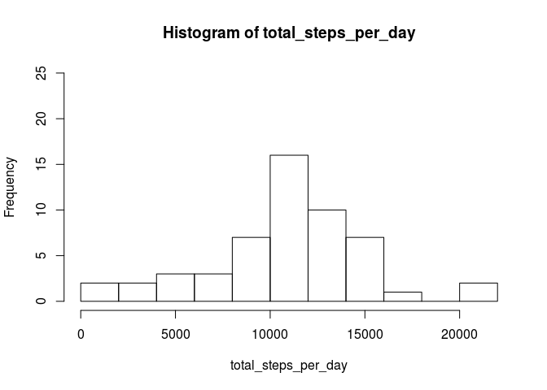

# Reproducible Research: Peer Assessment 1


## Loading and preprocessing the data


```r
data = read.csv('activity.csv')
head(data)
```

```
##   steps       date interval
## 1    NA 2012-10-01        0
## 2    NA 2012-10-01        5
## 3    NA 2012-10-01       10
## 4    NA 2012-10-01       15
## 5    NA 2012-10-01       20
## 6    NA 2012-10-01       25
```

```r
tail(data)
```

```
##       steps       date interval
## 17563    NA 2012-11-30     2330
## 17564    NA 2012-11-30     2335
## 17565    NA 2012-11-30     2340
## 17566    NA 2012-11-30     2345
## 17567    NA 2012-11-30     2350
## 17568    NA 2012-11-30     2355
```


## What is mean total number of steps taken per day?

Per the assignment instructions, we will for now (naively) limit our analysis for this
problem to non-missing values:


```r
cleaned <- data[!is.na(data$steps),]
```

Find the total number of steps per day, excluding missing values:


```r
by_date <- split(cleaned, cleaned$date)
total_steps_per_day <- sapply(by_date, function (date) { sum(date$steps) })
```

Histogram of total steps per day:


```r
hist(total_steps_per_day, ylim = c(0, 35))
```

 

We can then calculate the mean and median number of steps taken per day as follows:


```r
mean(total_steps_per_day)
```

```
## [1] 9354.23
```

```r
median(total_steps_per_day)
```

```
## [1] 10395
```


## What is the average daily activity pattern?

To find the average number of steps per 5-minute interval across all days, we split the
cleaned dataset (i.e., still ignoring NAs) across the interval numbers:


```r
by_interval = split(cleaned, cleaned$interval)
averages <- sapply(by_interval, function (interval) { mean(interval$steps) })
plot(x = names(averages),
     y = averages,
     type = 'l',
     xlab='Time of day',
     ylab='Average steps taken')
```

 

We can figure out which of these 5-minute intervals, averaged across days, contained the
most steps as follows:


```r
averages <- data.frame(interval = names(averages), average_steps=averages)
library(dplyr)
```

```
## 
## Attaching package: 'dplyr'
## 
## The following objects are masked from 'package:stats':
## 
##     filter, lag
## 
## The following objects are masked from 'package:base':
## 
##     intersect, setdiff, setequal, union
```

```r
tail(arrange(averages, average_steps))
```

```
##     interval average_steps
## 283      820      171.1509
## 284      830      177.3019
## 285      845      179.5660
## 286      850      183.3962
## 287      840      195.9245
## 288      835      206.1698
```

As we can see from the sorted data frame, interval 835 had the highest average number of
steps across all days.


## Imputing missing values

The number of rows (measurement intervals) missing data can be found as follows:


```r
sum(is.na(data$steps))
```

```
## [1] 2304
```

As a way to estimate these missing data values, we will use the average values for the
5-minute intervals as calculated earlier in this assignment.

A dataset which "fills in" these missing values using this strategy can be constructed as
follows:


```r
interpolated <- data
for(i in 1:nrow(data)) {
  if(is.na(data$steps[i])) {
    interval <- data$interval[i]
    estimated_steps <- averages$average_steps[averages$interval == interval]
    interpolated$steps[i] <- estimated_steps
  }
}
```

Now we can recalculate the total number of steps taken per day and do a new histogram:


```r
by_date <- split(interpolated, interpolated$date)
total_steps_per_day <- sapply(by_date, function (date) { sum(date$steps) })
hist(total_steps_per_day, ylim = c(0, 35))
```

 

And we can calculate the mean and median of the new dataset as follows:


```r
mean(total_steps_per_day)
```

```
## [1] 10766.19
```

```r
median(total_steps_per_day)
```

```
## [1] 10766.19
```

An interesting question to ask up front is how to deal with the issue of missing values in our data.

The assignment instructs that, "For this part of the assignment, you can ignore the missing values in the dataset."  However, it's probably wise to get an initial sense of exactly how frequent these missing values were and how they are distributed throughout the dataset:  a day which consists strictly of NA values could probably be ignored entirely from our analysis, whereas a day which requires a mix of NA and non-NA values might or might not be useful for our analysis depending on the percentage of values missing.


## Are there differences in activity patterns between weekdays and weekends?
